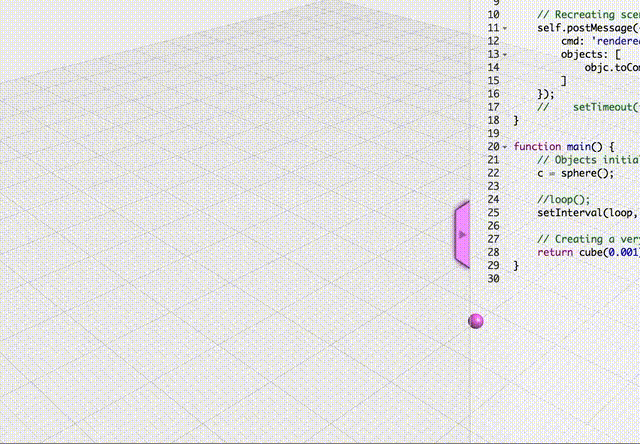

# openjscad_animation
Simple animation in OpenJsCad

https://openjscad.org/#https://erasta.github.io/openjscad_animation/clock_anim.js

The animation is of a moving sphere in circles around the middle.

Note: After changing the code, to avoid flickering, you need restart openjscad.

